<div align="center">
  
# Jhoom-Ultra
### *Advanced Telegram Music Bot with Auto-Update System*


[](https://python.org)
[](https://telegram.org)
[](LICENSE)
[](https://github.com/yourusername/JhoomMusic/stargazers)


</div>

## 🌟 **Key Features**

<table>
<tr>
<td width="50%">

### 🎵 **Music Features**
- 🎧 High Quality Audio Streaming
- 🎬 Video Playback Support  
- 📱 Live Stream Compatibility
- 🎛️ Advanced Queue Management
- 🔄 Loop & Shuffle Options
- ⚡ Fast Song Search

</td>
<td width="50%">

### 🛡️ **Admin Features**
- 👥 User Authorization System
- 🔐 Admin-Only Commands
- 📊 Real-time Statistics
- 🌍 Multi-language Support
- 🎨 Beautiful Inline UI
- 🔧 Auto-Update System

</td>
</tr>
</table>

<div align="center">

</div>

## 🚀 **Quick Deploy Options**

<div align="center">

### **Choose Your Deployment Method**

<table>
<tr>
<td align="center" width="25%">

<br><br>
<a href="https://heroku.com/deploy?template=https://github.com/yourusername/JhoomMusic">

</a>
</td>
<td align="center" width="25%">

<br><br>
<a href="https://railway.app/new/template?template=https://github.com/yourusername/JhoomMusic">

</a>
</td>
<td align="center" width="25%">

<br><br>
<code>docker-compose up -d</code>
</td>
<td align="center" width="25%">

<br><br>
<code>bash deploy.sh</code>
</td>
</tr>
</table>

</div>

<div align="center">

</div>

## 🔧 **Auto-Update System**

<div align="center">

### **🎯 Revolutionary CI/CD Pipeline**

```mermaid
graph LR
    A[📝 Code Push] --> B[🔍 GitHub Actions]
    B --> C[🧪 Run Tests]
    C --> D[🚀 Deploy Signal]
    D --> E[📡 Update Server]
    E --> F[🔄 All Bots Updated]
    F --> G[📱 Telegram Alert]
```


</div>



<table>
<tr>
<td width="50%">

### ✅ **What You Get:**
- 🔁 **GitHub पर code update करो**
- 🔧 **सभी users के bots अपने-आप update**
- ❌ **कोई manual token नहीं मांगता**
- ✅ **Telegram alert मिले**
- ✅ **Complete CI/CD ready**

</td>
<td width="50%">

### 🛠️ **Supported Platforms:**
- 🖥️ **VPS (Ubuntu/CentOS)**
- 🐳 **Docker Containers**
- 🚂 **Railway Deployment**
- ☁️ **Heroku Apps**
- 🌐 **Custom Webhooks**

</td>
</tr>
</table>

<div align="center">

</div>

## 📋 **Commands Overview**

<div align="center">

### **🎵 Music Commands**

<table>
<tr>
<td align="center" width="20%">

<br><code>/play song_name</code>
</td>
<td align="center" width="20%">

<br><code>/pause</code>
</td>
<td align="center" width="20%">

<br><code>/skip</code>
</td>
<td align="center" width="20%">

<br><code>/stop</code>
</td>
<td align="center" width="20%">

<br><code>/queue</code>
</td>
</tr>
</table>

### **👑 Admin Commands**

<table>
<tr>
<td align="center" width="25%">

<br><code>/auth @user</code>
</td>
<td align="center" width="25%">

<br><code>/mute</code>
</td>
<td align="center" width="25%">

<br><code>/shuffle</code>
</td>
<td align="center" width="25%">

<br><code>/clear</code>
</td>
</tr>
</table>

</div>

<div align="center">

</div>

## ⚙️ **Configuration Setup**

<div align="center">

### **🔑 Required Variables**

</div>

<table>
<tr>
<td width="50%">

```env
# 🤖 Bot Configuration
API_ID=12345678
API_HASH=your_api_hash_here
BOT_TOKEN=123456:ABC-DEF1234ghIkl-zyx57W2v1u123ew11

# 🎵 Assistant Configuration  
STRING_SESSION=your_pyrogram_session

# 📊 Database Configuration
MONGO_DB_URI=mongodb://localhost:27017/jhoom

# 👤 Admin Configuration
OWNER_ID=123456789
LOG_GROUP_ID=-100123456789
```

</td>
<td width="50%">

```env
# 🆘 Support Configuration
SUPPORT_CHAT=https://t.me/JhoomSupport
SUPPORT_CHANNEL=https://t.me/JhoomUpdates

# 🎛️ Music Configuration
DURATION_LIMIT=60
VIDEO_STREAM_LIMIT=3
AUTO_LEAVING_ASSISTANT=True

# 🔄 Auto-Update Configuration
UPDATE_SERVER_URL=https://your-domain.com
UPDATE_API_KEY=your_secret_key
```

</td>
</tr>
</table>

<div align="center">

</div>

## 🖥️ **VPS Deployment Guide**

<div align="center">

### **🚀 One-Click VPS Setup**

</div>

```bash
# 📥 Download and run auto-installer
curl -sSL https://raw.githubusercontent.com/yourusername/JhoomMusic/main/deploy.sh | bash

# 🔧 Or manual installation
git clone https://github.com/yourusername/JhoomMusic
cd JhoomMusic
chmod +x setup.sh
./setup.sh
```

<table>
<tr>
<td width="50%">

### **🐧 Ubuntu/Debian**
```bash
# Update system
sudo apt update && sudo apt upgrade -y

# Install dependencies
sudo apt install python3 python3-pip git ffmpeg -y

# Clone and setup
git clone https://github.com/yourusername/JhoomMusic
cd JhoomMusic
pip3 install -r requirements.txt

# Configure environment
cp .env.example .env
nano .env

# Generate session
python3 generate_session.py

# Run with systemd
sudo cp jhoommusic.service /etc/systemd/system/
sudo systemctl enable jhoommusic
sudo systemctl start jhoommusic
```

</td>
<td width="50%">

### **🎩 CentOS/RHEL**
```bash
# Update system
sudo yum update -y

# Install dependencies
sudo yum install python3 python3-pip git ffmpeg -y

# Clone and setup
git clone https://github.com/yourusername/JhoomMusic
cd JhoomMusic
pip3 install -r requirements.txt

# Configure environment
cp .env.example .env
vi .env

# Generate session
python3 generate_session.py

# Run with systemd
sudo cp jhoommusic.service /etc/systemd/system/
sudo systemctl enable jhoommusic
sudo systemctl start jhoommusic
```

</td>
</tr>
</table>

<div align="center">

</div>

## 🐳 **Docker Deployment**

<div align="center">

### **🚢 Container-Based Deployment**

</div>

```yaml
# docker-compose.yml
version: '3.8'

services:
  jhoommusic:
    build: .
    container_name: jhoommusic-bot
    restart: unless-stopped
    environment:
      - API_ID=${API_ID}
      - API_HASH=${API_HASH}
      - BOT_TOKEN=${BOT_TOKEN}
      - STRING_SESSION=${STRING_SESSION}
      - MONGO_DB_URI=${MONGO_DB_URI}
    volumes:
      - ./downloads:/app/downloads
      - ./cache:/app/cache
    networks:
      - jhoommusic-network

networks:
  jhoommusic-network:
    driver: bridge
```

```bash
# 🚀 Quick Docker Commands
docker-compose up -d          # Start bot
docker-compose logs -f        # View logs  
docker-compose restart        # Restart bot
docker-compose down           # Stop bot
```

<div align="center">

</div>

## 🔧 **Troubleshooting Guide**

<div align="center">

### **🛠️ Common Issues & Solutions**

</div>

<table>
<tr>
<td width="50%">

### **❌ Common Problems**

**🤖 Bot Not Responding:**
```bash
# Check bot status
sudo systemctl status jhoommusic

# View logs
sudo journalctl -u jhoommusic -f

# Restart bot
sudo systemctl restart jhoommusic
```

**🎵 Audio Not Playing:**
```bash
# Check FFmpeg installation
ffmpeg -version

# Verify voice chat is active
# Ensure bot has admin permissions
```

</td>
<td width="50%">

### **✅ Quick Fixes**

**📱 Permission Issues:**
```bash
# Make bot admin in group
# Add assistant to log group
# Grant voice chat permissions
```

**💾 Memory Issues:**
```bash
# Monitor memory usage
htop

# Clear cache
rm -rf cache/*
rm -rf downloads/*

# Restart services
sudo systemctl restart jhoommusic
```

</td>
</tr>
</table>

<div align="center">

</div>

## 📊 **System Requirements**

<div align="center">

<table>
<tr>
<td align="center" width="25%">

<br><strong>Python 3.9+</strong>
</td>
<td align="center" width="25%">

<br><strong>512MB+ RAM</strong>
</td>
<td align="center" width="25%">

<br><strong>1GB+ Storage</strong>
</td>
<td align="center" width="25%">

<br><strong>Stable Internet</strong>
</td>
</tr>
</table>

</div>

<div align="center">

</div>

## 🤝 **Contributing**

<div align="center">

### **🌟 Join Our Development Team**


</div>

```bash
# 🍴 Fork the repository
git clone https://github.com/yourusername/JhoomMusic.git

# 🌿 Create feature branch  
git checkout -b feature/amazing-feature

# 💾 Commit changes
git commit -m "Add amazing feature"

# 📤 Push to branch
git push origin feature/amazing-feature

# 🔄 Open Pull Request
```

<div align="center">

</div>

## 🆘 **Support & Community**

<div align="center">

### **💬 Get Help & Stay Updated**

<table>
<tr>
<td align="center" width="33%">
<a href="https://t.me/JhoomMusicSupport">

</a>
<br><strong>24/7 Support</strong>
</td>
<td align="center" width="33%">
<a href="https://t.me/JhoomMusicChannel">

</a>
<br><strong>Latest Updates</strong>
</td>
<td align="center" width="33%">
<a href="https://github.com/yourusername/JhoomMusic/discussions">

</a>
<br><strong>Community Forum</strong>
</td>
</tr>
</table>

</div>

<div align="center">

</div>

## 📄 **License & Credits**

<div align="center">


### **🙏 Special Thanks**

<table>
<tr>
<td align="center" width="25%">

<br><strong>Pyrogram</strong>
<br><em>MTProto Framework</em>
</td>
<td align="center" width="25%">

<br><strong>TgCaller</strong>
<br><em>Voice Chat Integration</em>
</td>
<td align="center" width="25%">

<br><strong>yt-dlp</strong>
<br><em>YouTube Support</em>
</td>
<td align="center" width="25%">

<br><strong>MongoDB</strong>
<br><em>Database Support</em>
</td>
</tr>
</table>

</div>

<div align="center">

</div>

## ⭐ **Star History**

<div align="center">

<a href="https://star-history.com/#yourusername/JhoomMusic&Date">
  <picture>
    <source media="(prefers-color-scheme: dark)" srcset="https://api.star-history.com/svg?repos=yourusername/JhoomMusic&type=Date&theme=dark" />
    <source media="(prefers-color-scheme: light)" srcset="https://api.star-history.com/svg?repos=yourusername/JhoomMusic&type=Date" />
    
  </picture>
</a>

</div>

<div align="center">


### **Made with ❤️ by JhoomMusic Team**


**If this project helped you, please consider giving it a ⭐**

</div>
